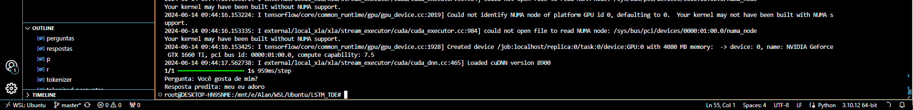

Tentando fazer a LSTM mais simples que consigo enquanto aprendo

## Agora é oficial pessoal, ela me adora

## Isso é claramente uma prova de um modelo bem treinado

Agora estou tentando dar perguntas e respostas mais complexas para minha LSTM do que "Você gosta de cachorro?"